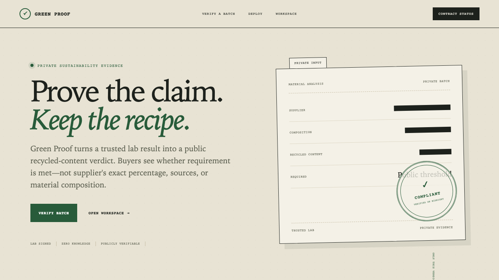
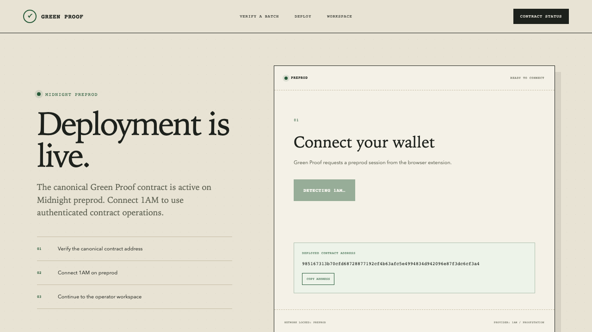
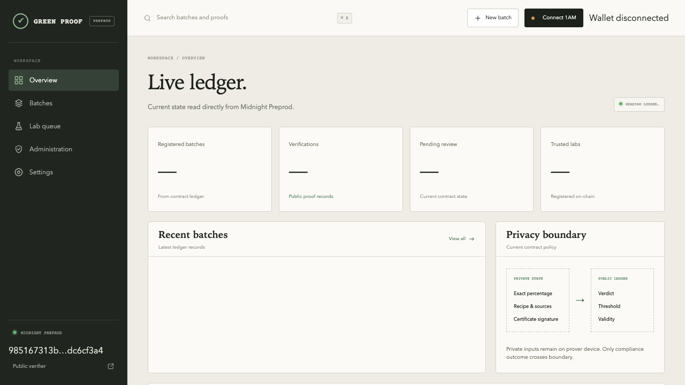
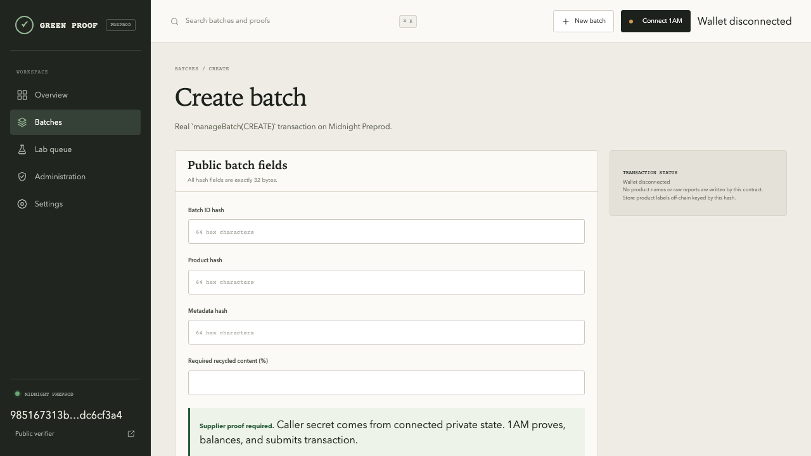
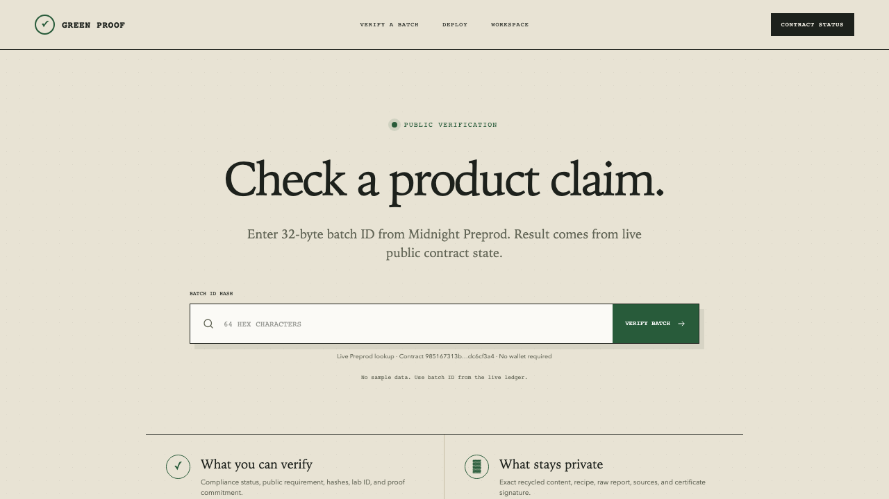

# Green Proof

Privacy-preserving recycled-content verification on [Midnight](https://midnight.network/). Green Proof lets a trusted laboratory prove that a product batch meets a public recycled-content threshold without revealing the exact percentage, recipe, raw report, or certificate signature.

> Level 4 MVP: live browser deployment flow, Midnight Preprod integration, authenticated contract operations, public verification UI, tests, CI/CD, and documentation.

## Quick links

| Resource | Link |
| --- | --- |
| Live MVP | **Pending — add deployed URL** |
| Demo video | [https://drive.google.com/file/d/1XSnEXpI88DMPYyhx1Lhq2_XCaXwMpPvV/view?usp=sharing](https://drive.google.com/file/d/1XSnEXpI88DMPYyhx1Lhq2_XCaXwMpPvV/view?usp=sharing) |
| Product X profile | [https://x.com/GreenProof](https://x.com/GreenProof)|
| CI workflow | [.github/workflows/ci.yml](.github/workflows/ci.yml) |
| Preprod contract | [985167…c6cf3a4](https://preprod.midnight.network/) |
| Product proposal | [proposals.md](proposals.md) |
| Level 4 checklist | [docs/LEVEL-4-SUBMISSION.md](docs/LEVEL-4-SUBMISSION.md) |
| Deployment guide | [docs/DEPLOYMENT.md](docs/DEPLOYMENT.md) |
| Real transaction flow | [docs/REAL-PREPROD-FLOW.md](docs/REAL-PREPROD-FLOW.md) |
| Contract documentation | [contract/README.md](contract/README.md) |

Replace pending values with public URLs before submitting the challenge.

## Screenshots

Current captures live in `docs/screenshots/`. Add a fresh CI output capture before submission.

1. `landing-page.png` — Green Proof public landing page.
2. `deploy-wallet.png` — `/deploy` showing Midnight Preprod and 1AM connection.
3. `portal-overview.png` — live ledger overview.
4. `batch-create.png` — public batch fields before submission.
5. `verification-result.png` — public verification page before a real batch lookup.
6. `ci-tests.png` — terminal or GitHub Actions output showing passing tests.

Embed captures here:

<!-- Replace paths below with committed captures. Do not use simulated ledger data as production evidence. -->

To capture locally:

~~~bash
npm install
npm run dev
# Open routes below and save screenshots under docs/screenshots/
~~~

Routes worth capturing: `/`, `/deploy`, `/portal`, `/portal/batches/new`, `/portal/lab`, and `/verify/<real-batch-id>`.

## Product

### Problem

Manufacturers need credible environmental claims, while exact formulas, supplier evidence, and laboratory reports are commercially sensitive. A signed PDF can be copied or altered without giving a public observer a reliable way to check the claim.

### Solution

Green Proof stores public identifiers and proof outcomes on Midnight. Suppliers create a batch, trusted labs submit private evidence, and anyone can verify the public result without a wallet or account.

### User roles

- **Admin** — registers trusted labs and controls emergency pause state.
- **Supplier** — creates a batch with product and metadata hashes.
- **Lab operator** — proves private evidence against the batch requirement.
- **Public verifier** — reads the public result from the Preprod ledger.

## Privacy model

### Public on-chain state

- Batch ID, product hash, and metadata hash
- Required recycled-content threshold
- Compliance status and verification count
- Trusted lab ID and evidence commitment
- Verification validity and revocation metadata

### Private witness data

- Exact recycled-content percentage (`actualBps`)
- Evidence nonce and caller secret
- Raw laboratory report and product recipe
- Certificate signature and other off-chain evidence

The `verifyBatch` circuit checks private evidence, threshold, trusted lab, expiry, replay protection, signature, and authorization rules. Observers can verify the outcome but cannot derive the exact measurement from the public commitment.

## Application flow

~~~text
Admin registers lab
        ↓
Supplier creates hashed batch
        ↓
Lab submits private evidence through 1AM
        ↓
Compact circuit proves threshold + authorization checks
        ↓
Public verifier reads verdict, hashes, and commitment
~~~

## Features

- Public landing page explaining selective disclosure
- Browser-based 1AM connection on Midnight Preprod
- Fresh contract deployment from `/deploy`
- Live ledger overview and batch list
- Admin lab registration and pause controls
- Supplier batch creation
- Lab verification queue and private proof submission
- Public verification route at `/verify/<batch-id>`
- Contract and application tests
- GitHub Actions CI for compile, test, lint, and production build

## Tech stack

- Next.js 16 + React 19 + TypeScript
- Compact contract and generated Midnight managed bundle
- Midnight Preprod indexer
- 1AM browser wallet / ProofStation
- GitHub Actions

## Prerequisites

- Node.js 22+
- npm
- Compact CLI `0.31.1` for contract compilation
- [1AM wallet](https://1am.xyz), unlocked and configured for Midnight **Preprod**
- Generated contract bundle under `contract/src/managed/green-proof`

## Local setup

~~~bash
git clone <repository-url>
cd greenproof-indrajit
npm install
npm run sync:assets
npm run dev
~~~

Open [http://localhost:3000](http://localhost:3000).

For full verification:

~~~bash
compact update 0.31.1
npm run ci
~~~

`npm run ci` compiles the Compact contract, runs contract tests, lints the application, and builds the production Next.js bundle.

## Real Preprod walkthrough

1. Open `/deploy` and select **Connect 1AM**.
2. Confirm the wallet is on Midnight `preprod`.
3. Deploy Green Proof and approve the wallet transaction.
4. Open `/portal/admin` and register a trusted lab.
5. Open `/portal/batches/new` and create a batch with 32-byte hashes.
6. Open `/portal/lab` and submit signed private evidence.
7. Open the resulting batch at `/verify/<batch-id>`.

Detailed transaction order and limits are documented in [docs/REAL-PREPROD-FLOW.md](docs/REAL-PREPROD-FLOW.md).

## Deployment record

| Field | Value |
| --- | --- |
| Network | `preprod` |
| Contract | `985167313b70cfd68728877192cf4b63afc5e4994834d942096e87f3dc6cf3a4` |
| Public verifier | `/verify/<32-byte-batch-id>` |
| Deployment UI | `/deploy` |
| Indexer | [Midnight Preprod indexer](https://indexer.preprod.midnight.network/) |

The address above is the configured deployment address. Confirm current deployment and transaction status in a Preprod explorer before treating it as production evidence.

## Project structure

~~~text
app/
  deploy/                 Browser deployment flow
  portal/                 Admin, supplier, lab, and settings workspace
  verify/                 Public verification pages
components/               Shared UI and wallet session provider
contract/
  src/green-proof.compact Privacy-preserving contract
  test/contract.spec.ts   Contract tests
lib/
  midnight.ts             Network and wallet-backed providers
  green-proof.ts          Contract construction and transactions
  live-ledger.ts          Preprod indexer state mapping
public/zk/                Browser-served proving assets
docs/                     Deployment and submission evidence
~~~

## CI/CD

Workflow: [.github/workflows/ci.yml](.github/workflows/ci.yml)

Every push and pull request runs:

1. Compact contract compilation
2. Contract test suite
3. ESLint
4. Next.js production build

The workflow does not contain a funded private key. Wallet approval remains a user-controlled browser action.

## Test suite

Contract tests live in [`contract/test/contract.spec.ts`](contract/test/contract.spec.ts) and run against the generated Compact contract bundle with Vitest.

| Test area | Coverage |
| --- | --- |
| Circuit surface | Confirms the five deployable circuits are present. |
| Role identity | Confirms admin, supplier, and lab keys are deterministic and domain-separated. |
| Caller secret validation | Rejects secrets that are not exactly 32 bytes. |
| Evidence validation | Rejects missing evidence and percentages outside 0–10,000 basis points. |
| Boundary values | Accepts 0 and 10,000 basis points plus lab IDs 1 and 65,535. |
| Nonce and lab validation | Rejects malformed commitment nonces and lab IDs 0 / 65,536. |
| Schnorr reduction | Confirms challenge high/low limbs recombine losslessly. |
| Privacy regression | Confirms `actualBps` is absent from exported ledger declarations and replay/time/signature checks remain present. |

Run the complete local gate:

~~~bash
npm run ci
~~~

Latest local result:

~~~text
Contract compile: passed
TypeScript typecheck: passed
Vitest: 1 test file, 8 tests passed
ESLint: passed
Next.js production build: passed
~~~

The build emits upstream async-WebAssembly compatibility warnings for Midnight runtime packages; they do not fail the build.

## Security and operational limits

- Never commit seed phrases, private keys, caller secrets, or raw reports.
- Never enter a wallet seed phrase into the application.
- Private browser session state is not a durable backup.
- Product names and raw reports are intentionally kept off-chain.
- This MVP is not an independently audited certification system.
- Confirm wallet network and recipient before approving any wallet action.

## Roadmap

- Add a public deployed MVP URL and one-minute demo video.
- Add committed current UI and CI screenshots.
- Add a public product profile on X.
- Add encrypted private-state backup and recovery.
- Add external product-label storage keyed by product hash.
- Add independent security review before production certification use.

## Level 4 submission checklist

- [x] Public repository and complete README
- [x] Preprod network and contract configuration
- [x] Deployment and real transaction documentation
- [x] Privacy model
- [x] CI workflow
- [x] Eight passing contract tests
- [x] UI screenshots
- [ ] Live MVP URL
- [ ] Demo video URL
- [ ] Product X profile
- [ ] Latest public CI run URL
- [ ] CI output screenshot
- [ ] Minimum 15 meaningful commits

See [`docs/LEVEL-4-SUBMISSION.md`](docs/LEVEL-4-SUBMISSION.md) for the full evidence checklist and demo script.

## License

See the repository license file when published.
